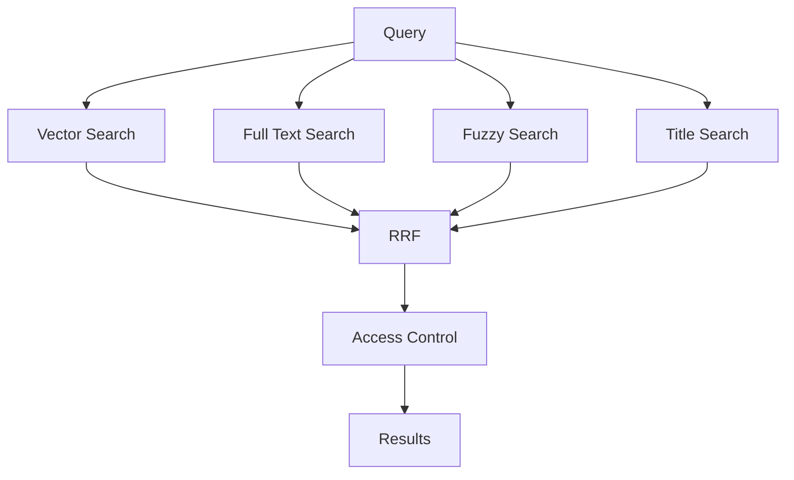

The result was not simply "a better search".

It was the replacement of an external dependency with search infrastructure that understands the nature of the content, uses PostgreSQL capabilities, and combines different relevance signals.

---

# 1. The problem: search does not only mean finding text

The first version of PLEI's search used Algolia.

It worked reasonably well for textual searches, but the platform's content started to require something different.

PLEI does not manage plain text only. The search engine works across resources that can represent courses, lessons, documents, and other platform content.

That changes the nature of the problem.

Suppose the query is:

```text
"how to improve sales management"
```

A purely textual search needs to find words related to:

```text
how
improve
management
sales
```

But the content that actually answers the intent could say:

```text
"Best practices for managing sales teams"
```

The words do not match exactly.

Semantically, however, they may be strongly related.

Now consider another query:

```text
"digital marketing"
```

There may be a resource whose title is exactly:

```text
Digital Marketing
```

In this case, an exact title match is a much stronger signal than semantic similarity.

And finally:

```text
"markting dijital"
```

An error-tolerant search may be the one that recovers the result.

The conclusion was clear:

> **The problem was not finding a better search strategy. It was combining strategies that solve different problems.**

---

# 2. Before and after

## Before

```text
User
   │
   ▼
Algolia
   │
   ▼
Results
```

Search depended on an external provider and a primary retrieval strategy.

## After

```text
User
   │
   ▼
Query normalization
   │
   ├──────────────┬──────────────┬──────────────┐
   ▼              ▼              ▼              ▼
Vector         Full Text       Fuzzy         Exact
   │              │              │              │
   └──────────────┴──────────────┴──────────────┘
                          │
                          ▼
                         RRF
                          │
                          ▼
                   Final ranking
                          │
                          ▼
                  Access Control
                          │
                          ▼
                      Results
```

The infrastructure now directly controls the signals that determine which result appears and why.

---

# 3. The architectural decision

The question was not simply:

> "What do we replace Algolia with?"

The better question was:

> "What search capabilities does the product actually need, and what infrastructure lets us combine them without depending on an external provider?"

The answer was to use PostgreSQL as the core of the solution.

For AI and search capabilities, a separate PostgreSQL database was introduced using:

- `pgvector` for vector search;
- `tsvector` for Full Text Search;
- `pg_trgm` for fuzzy matching.

Title search was built as a dedicated signal to favor direct matches with a resource name.

The resulting architecture was conceptually:

```text
                 PostgreSQL
                     │
        ┌────────────┼────────────┐
        │            │            │
        ▼            ▼            ▼
    pgvector      tsvector      pg_trgm
        │            │            │
        ▼            ▼            ▼
    Semantic     Full Text      Fuzzy
        │            │            │
        └────────────┬────────────┘
                     │
                     ▼
               Title Matching
                     │
                     ▼
                    RRF
```

The advantage was not only technological.

Search remained inside the same data infrastructure used by the rest of the application, without maintaining an external engine solely to solve the retrieval problem.

---

# 4. The four retrieval signals

The engine combines four types of signal:

```text
┌───────────────────────────────────────────────┐
│                 SMART SEARCH                  │
├─────────────┬────────────┬──────────┬─────────┤
│  Vector     │ Full Text  │  Fuzzy   │ Exact   │
│             │            │          │         │
│  semantic   │  words     │ errors   │ titles  │
│  intent     │  and phrases│ and typos│ direct │
└─────────────┴────────────┴──────────┴─────────┘
                       │
                       ▼
                      RRF
```

Each strategy answers a different question.

### Vector

> What content means something similar to what the user is asking?

### Full Text

> What content contains the words or expressions the user is looking for?

### Fuzzy

> What content is textually similar even if the query contains errors or variations?

### Exact

> Is there a resource whose title directly matches what the user wrote?

The goal is not to choose one.

It is to let each strategy contribute when it has useful information.

---

# 5. Vector search: understanding intent

Vector search uses embeddings stored through `pgvector`.

```text
Query
  │
  ▼
Embedding
  │
  ▼
Vector
  │
  ▼
pgvector
  │
  ▼
Semantically close results
```

The important characteristic is that the match does not depend exclusively on the words being identical.

A query can use one expression while the content uses another.

For example:

```text
Query:
"how to lead a team better"

Content:
"leadership and team management"
```

Even though the words do not completely match, there is a semantic relationship.

That is the space where vector search adds value.

## But it has a limitation

Semantic similarity is not always what the user needs.

If someone writes:

```text
"B2B Sales"
```

and there is a resource called exactly:

```text
B2B Sales
```

we want that direct match to carry a strong signal.

That is why vector search is only one piece.

---

# 6. Full Text Search: when words matter

PostgreSQL provides Full Text Search through `tsvector` and `websearch_to_tsquery`.

```text
Query
  │
  ▼
websearch_to_tsquery
  │
  ▼
tsvector
  │
  ▼
Text matches
```

This strategy can work with:

- words;
- phrases;
- operators;
- textual queries.

The question here is no longer:

> "What content has a similar meaning?"

It is:

> "What content contains terms that appear in this query?"

That makes Full Text Search complementary to vector retrieval.

---

# 7. Fuzzy search: tolerating how users actually type

Users do not always write exactly as the content is written.

There can be:

```text
typos
abbreviations
variations
spelling errors
```

Fuzzy search uses `pg_trgm` to detect textual similarity.

Conceptually:

```text
"marketing dijital"
        │
        ▼
   pg_trgm
        │
        ▼
"marketing digital"
```

The difference from vector search is important.

Vector search tries to approximate **meaning**.

Fuzzy search tries to approximate **textual form**.

They solve different problems.

---

# 8. Exact title matching

Titles have special value.

If the user writes:

```text
"Introduction to Sales"
```

and there is a resource with exactly that title, we do not need a semantic strategy to "discover" that it is probably relevant.

We already have a direct signal.

```text
Query
   │
   ▼
Title Matching
   │
   ▼
Direct match
```

This strategy favors results whose name matches the query.

It is especially useful when the user already knows which resource they are looking for.

---

# 9. The problem of combining results

This is where one of the most interesting design problems appears.

Each strategy produces its own ranked list:

```text
VECTOR

1. Resource A
2. Resource C
3. Resource B
4. Resource D


FULL TEXT

1. Resource B
2. Resource A
3. Resource E
4. Resource C


FUZZY

1. Resource D
2. Resource A
3. Resource B
4. Resource F


EXACT

1. Resource C
2. Resource A
```

Now we need to produce:

```text
                 Single ranking
                       │
        ┌──────────────┼──────────────┐
        ▼              ▼              ▼
    Semantic        Textual         Exact
        │              │              │
        └──────────────┼──────────────┘
                       ▼
                    Ranking
```

The problem is that the scores from each strategy do not necessarily use the same scale.

It would not be correct to assume that:

```text
vector score = 0.82
```

can be directly compared with:

```text
text score = 0.82
```

They are metrics produced by different mechanisms.

The solution was to work with **rank position**, not raw scores.

---

# 10. Reciprocal Rank Fusion

The technique used to combine the results was **Reciprocal Rank Fusion (RRF)**.

The idea is simple:

> A document receives contribution for appearing high in one or more ranked lists.

```text
Vector Search ──────┐
                    │
Full Text Search ───┼──► RRF ───► Final ranking
                    │
Fuzzy Search ───────┤
                    │
Title Search ───────┘
```

Conceptually, the contribution of a result depends on its position:

```text
score(rank) = 1 / (k + rank)
```

We do not need the internal scores from each search strategy to be comparable.

What matters is:

```text
Where did this document appear?
```

If a document ranks highly across several strategies, it accumulates evidence.

---

# 11. Why RRF fits this problem

Suppose:

```text
Document A
Vector → #1
Full Text → #7
Fuzzy    → #3
Exact    → not found
```

Another:

```text
Document B
Vector → #8
Full Text → #1
Fuzzy    → #2
Exact    → not found
```

And another:

```text
Document C
Vector → not found
Full Text → not found
Fuzzy    → not found
Exact    → #1
```

The final ranking does not depend on a single definition of relevance.

It depends on accumulated evidence.

```text
                 RRF
                  │
       ┌──────────┼──────────┐
       ▼          ▼          ▼
    Document A  Document B  Document C
       │             │           │
   several signals several signals exact match
       │             │           │
       └─────────────┼───────────┘
                     ▼
                Final ranking
```

This allows semantic, textual, and direct title matches to compete inside one ranking system.

---

# 12. Orchestration: these are not four independent searches

The engine does not expose four different search engines to the user.

The user makes one query:

```text
"commercial leadership course"
```

Internally:



The complexity remains encapsulated inside the engine.

From the product's point of view, there is still a single search experience.

---

# 13. Relevance does not mean authorization

This was another important design consideration.

An engine can find a perfectly relevant document and that document can still be forbidden for a particular user.

Search must respect access restrictions related to:

- roles;
- hierarchies;
- brands;
- business lines;
- visibility.

That is why the conceptual flow does not end at RRF:

```text
Retrieval
     ↓
Ranking
     ↓
Can this user see it?
     │
 ┌───┴────┐
 │        │
Yes       No
 │        │
 ▼        ▼
Show    Discard
```

The distinction is fundamental:

```text
Relevance
     +
Authorization
     =
Valid result
```

A document can be the search engine's number-one result and still be invalid for a specific user.

---

# 14. Keeping embeddings synchronized

Vector search introduces another problem.

PLEI's content changes.

If a course, resource, or lesson changes, its semantic representation can become stale.

That is why generating embeddings only once is not enough.

The infrastructure includes a mapping between models and processors:

```text
Course     → CourseEventProcessor
Resource   → ResourceEventProcessor
Lesson     → LessonEventProcessor
Novelty    → NoveltyEventProcessor
Offer      → OfferEventProcessor
Seminar    → SeminarEventProcessor
```

Each processor transforms its corresponding content into the text that should be used to generate its embedding.

```text
Model
  │
  ▼
Processor
  │
  ▼
Enriched text
  │
  ▼
AI Provider
  │
  ▼
Embedding
  │
  ▼
PostgreSQL
```

The consequence is important:

> **The semantic representation can remain synchronized with the content it represents.**

This is not only about building an index.

It is about keeping that index coherent with the product.

---

# 15. One database for different signals

One of the most interesting implementation decisions was not to create separate infrastructure for each search type.

The same PostgreSQL ecosystem provides:

```text
                    PostgreSQL
                        │
        ┌───────────────┼────────────────┐
        │               │                │
        ▼               ▼                ▼
     pgvector         tsvector         pg_trgm
        │               │                │
    Semantic         Full Text          Fuzzy
        │               │                │
        └───────────────┼────────────────┘
                        │
                        ▼
                  Title Matching
                        │
                        ▼
                       RRF
```

This reduces architectural fragmentation.

Hybrid search is built using specialized capabilities on top of persistence infrastructure that the product already uses.

---

# 16. Replacing Algolia was not only a technology change

Changing providers could look like a mechanical task:

```text
Algolia
   ↓
PostgreSQL
```

But that was not the goal.

The real change was moving from:

```text
One search strategy
```

to:

```text
A composite retrieval system
```

Before:

```text
Query
   ↓
Algolia
   ↓
Results
```

After:

```text
Query
   │
   ├── meaning
   ├── words
   ├── textual similarity
   └── title
          │
          ▼
         RRF
          │
          ▼
    Final ranking
```

Algolia offered good search over indexed text.

The hybrid engine on PostgreSQL made it possible to build a retrieval system tailored to PLEI's domain, combining semantic search, textual search, fuzzy search, title matching, and access control on top of a single infrastructure.
