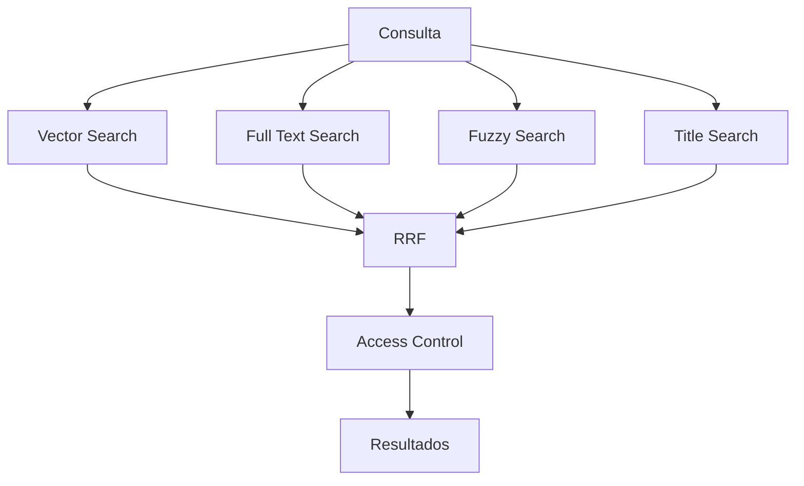

El resultado no fue simplemente "hacer una búsqueda más".

Fue reemplazar una dependencia externa por una infraestructura de búsqueda que conoce la naturaleza del contenido, utiliza las capacidades de PostgreSQL y combina diferentes señales de relevancia.

---

# 1. El problema: buscar no significa solamente encontrar texto

La primera versión del buscador de PLEI utilizaba Algolia.

Funcionaba razonablemente bien para búsquedas textuales, pero el contenido de la plataforma empezó a requerir algo diferente.

PLEI no maneja únicamente texto plano. El buscador trabaja sobre recursos que pueden representar cursos, lecciones, documentos y otros contenidos de la plataforma.

Eso cambia la naturaleza del problema.

Supongamos una consulta:

```text
"cómo mejorar la gestión comercial"
```

Un buscador puramente textual necesita encontrar palabras relacionadas con:

```text
cómo
mejorar
gestión
comercial
```

Pero el contenido que realmente responde a la intención podría decir:

```text
"Buenas prácticas para administrar equipos de ventas"
```

Las palabras no coinciden exactamente.

Semánticamente, sin embargo, podrían estar muy relacionadas.

Ahora consideremos otra consulta:

```text
"marketing digital"
```

Aquí sí puede existir un recurso cuyo título sea exactamente:

```text
Marketing Digital
```

En este caso, la coincidencia exacta del título es una señal mucho más fuerte que una similitud semántica.

Y finalmente:

```text
"markting dijital"
```

Una búsqueda tolerante a errores puede ser la que rescate el resultado.

La conclusión fue clara:

> **El problema no era encontrar una estrategia de búsqueda mejor. Era combinar estrategias que resolvieran problemas diferentes.**

---

# 2. Antes y después

## Antes

```text
Usuario
   │
   ▼
Algolia
   │
   ▼
Resultados
```

La búsqueda dependía de un proveedor externo y de una estrategia principal de recuperación.

## Después

```text
Usuario
   │
   ▼
Query normalization
   │
   ├──────────────┬──────────────┬──────────────┐
   ▼              ▼              ▼              ▼
Vectorial      Full Text       Difusa         Exacta
   │              │              │              │
   └──────────────┴──────────────┴──────────────┘
                         │
                         ▼
                        RRF
                         │
                         ▼
                  Ranking final
                         │
                         ▼
                Access Control
                         │
                         ▼
                     Resultados
```

La infraestructura pasó a controlar directamente las señales que determinan qué resultado aparece y por qué.

---

# 3. La decisión arquitectónica

La pregunta no era simplemente:

> "¿Con qué reemplazamos Algolia?"

La pregunta correcta era:

> "¿Qué capacidades de búsqueda necesita realmente el producto y qué infraestructura permite combinarlas sin depender de un proveedor externo?"

La respuesta fue aprovechar PostgreSQL como núcleo de la solución.

Para las funcionalidades de IA y búsqueda se incorporó una base PostgreSQL independiente utilizando:

- `pgvector` para búsqueda vectorial;
- `tsvector` para Full Text Search;
- `pg_trgm` para coincidencias difusas.

La búsqueda por títulos se construyó como una señal específica para favorecer coincidencias directas con el nombre del recurso.

La arquitectura resultante quedó conceptualmente así:

```text
                 PostgreSQL
                     │
        ┌────────────┼────────────┐
        │            │            │
        ▼            ▼            ▼
    pgvector      tsvector      pg_trgm
        │            │            │
        ▼            ▼            ▼
   Semántica     Full Text      Difusa
        │            │            │
        └────────────┬────────────┘
                     │
                     ▼
               Title Matching
                     │
                     ▼
                    RRF
```

La ventaja no fue solamente tecnológica.

La búsqueda quedó dentro de la misma infraestructura de datos que el resto de la aplicación, sin necesitar mantener un motor externo exclusivamente para resolver el problema de recuperación.

---

# 4. Las cuatro señales de recuperación

El motor combina cuatro tipos de señal:

```text
┌───────────────────────────────────────────────┐
│                 SMART SEARCH                  │
├─────────────┬────────────┬──────────┬─────────┤
│  Vectorial  │ Full Text  │  Difusa  │ Exacta  │
│             │            │          │         │
│  intención  │  palabras  │ errores  │ títulos │
│  semántica  │  y frases  │  y typo  │ directos│
└─────────────┴────────────┴──────────┴─────────┘
                       │
                       ▼
                      RRF
```

Cada estrategia responde a una pregunta diferente.

### Vectorial

> ¿Qué contenido significa algo parecido a lo que está preguntando el usuario?

### Full Text

> ¿Qué contenido contiene las palabras o expresiones que está buscando?

### Difusa

> ¿Qué contenido se parece textualmente aunque la consulta tenga errores o variaciones?

### Exacta

> ¿Existe un recurso cuyo título coincide directamente con lo que escribió?

No se trata de elegir una.

Se trata de permitir que cada una contribuya cuando tiene información útil.

---

# 5. Búsqueda vectorial: entender la intención

La búsqueda vectorial utiliza embeddings almacenados mediante `pgvector`.

```text
Consulta
   │
   ▼
Embedding
   │
   ▼
Vector
   │
   ▼
pgvector
   │
   ▼
Resultados semánticamente cercanos
```

La característica importante es que la coincidencia no depende exclusivamente de que las palabras sean iguales.

Una consulta puede utilizar una expresión y el contenido otra.

Por ejemplo:

```text
Consulta:
"cómo dirigir mejor un equipo"

Contenido:
"liderazgo y gestión de equipos"
```

Aunque las palabras no coincidan completamente, existe una relación semántica.

Ese es el espacio donde la búsqueda vectorial aporta valor.

## Pero tiene una limitación

La similitud semántica no siempre es lo que el usuario necesita.

Si alguien escribe:

```text
"Ventas B2B"
```

y existe un recurso llamado exactamente:

```text
Ventas B2B
```

queremos que esa coincidencia directa tenga una señal fuerte.

Por eso la búsqueda vectorial es solamente una pieza.

---

# 6. Full Text Search: cuando las palabras importan

PostgreSQL proporciona Full Text Search mediante `tsvector` y `websearch_to_tsquery`.

```text
Consulta
   │
   ▼
websearch_to_tsquery
   │
   ▼
tsvector
   │
   ▼
Coincidencias textuales
```

Esta estrategia permite trabajar con:

- palabras;
- frases;
- operadores;
- consultas textuales.

Aquí la pregunta ya no es:

> "¿Qué contenido tiene un significado parecido?"

Sino:

> "¿Qué contenido contiene términos que aparecen en esta consulta?"

Eso hace que Full Text Search sea complementario al retrieval vectorial.

---

# 7. Búsqueda difusa: tolerar cómo escribe realmente un usuario

Los usuarios no siempre escriben exactamente como aparece el contenido.

Pueden existir:

```text
typos
abreviaciones
variaciones
errores ortográficos
```

La búsqueda difusa utiliza `pg_trgm` para detectar similitudes textuales.

Conceptualmente:

```text
"marketing dijital"
        │
        ▼
   pg_trgm
        │
        ▼
"marketing digital"
```

La diferencia respecto a la búsqueda vectorial es importante.

La búsqueda vectorial intenta aproximarse al **significado**.

La búsqueda difusa intenta aproximarse a la **forma textual**.

Son problemas diferentes.

---

# 8. Coincidencia exacta de títulos

Los títulos tienen un valor especial.

Si el usuario escribe:

```text
"Introducción a Ventas"
```

y existe un recurso con exactamente ese título, no necesitamos que una estrategia semántica "descubra" que probablemente sea relevante.

Ya tenemos una señal directa.

```text
Consulta
   │
   ▼
Title Matching
   │
   ▼
Coincidencia directa
```

Esta estrategia favorece resultados cuyo nombre coincide con la consulta.

Es especialmente útil cuando el usuario ya sabe qué recurso está buscando.

---

# 9. El problema de combinar los resultados

Aquí aparece uno de los problemas más interesantes del diseño.

Cada estrategia produce su propia lista ordenada:

```text
VECTORIAL

1. Recurso A
2. Recurso C
3. Recurso B
4. Recurso D


FULL TEXT

1. Recurso B
2. Recurso A
3. Recurso E
4. Recurso C


DIFUSA

1. Recurso D
2. Recurso A
3. Recurso B
4. Recurso F


EXACTA

1. Recurso C
2. Recurso A
```

Ahora necesitamos producir:

```text
                 Ranking único
                       │
        ┌──────────────┼──────────────┐
        ▼              ▼              ▼
    Semántica       Textual         Exacta
        │              │              │
        └──────────────┼──────────────┘
                       ▼
                    Ranking
```

El problema es que los scores de cada estrategia no representan necesariamente la misma escala.

No sería correcto asumir que:

```text
vector score = 0.82
```

puede compararse directamente con:

```text
text score = 0.82
```

Son métricas provenientes de mecanismos diferentes.

La solución fue trabajar con **posición dentro del ranking**, no con scores crudos.

---

# 10. Reciprocal Rank Fusion

La técnica utilizada para combinar los resultados fue **Reciprocal Rank Fusion (RRF)**.

La idea es sencilla:

> Un documento recibe contribución por aparecer bien posicionado en una o varias listas.

```text
Vector Search ──────┐
                    │
Full Text Search ───┼──► RRF ───► Ranking final
                    │
Fuzzy Search ───────┤
                    │
Title Search ───────┘
```

Conceptualmente, la contribución de un resultado depende de su posición:

```text
score(rank) = 1 / (k + rank)
```

No necesitamos que los scores internos de cada buscador sean comparables.

Lo importante es:

```text
¿En qué posición apareció este documento?
```

Si un documento aparece bien posicionado en varias estrategias, acumula evidencia.

---

# 11. Por qué RRF encaja bien aquí

Supongamos:

```text
Documento A
Vectorial → #1
Full Text → #7
Difusa    → #3
Exacta    → no aparece
```

Otro:

```text
Documento B
Vectorial → #8
Full Text → #1
Difusa    → #2
Exacta    → no aparece
```

Y otro:

```text
Documento C
Vectorial → no aparece
Full Text → no aparece
Difusa    → no aparece
Exacta    → #1
```

El ranking final no depende de una única forma de relevancia.

Depende de la evidencia acumulada.

```text
                 RRF
                  │
       ┌──────────┼──────────┐
       ▼          ▼          ▼
    Documento A  Documento B  Documento C
       │             │           │
   varias señales varias señales exact match
       │             │           │
       └─────────────┼───────────┘
                     ▼
              Ranking final
```

Eso permite que una coincidencia semántica, una textual y una coincidencia directa de título compitan dentro de un mismo sistema de ranking.

---

# 12. Orquestación: no son cuatro búsquedas independientes

El motor no expone cuatro buscadores diferentes al usuario.

El usuario hace una sola consulta:

```text
"curso de liderazgo comercial"
```

Internamente:



La complejidad queda encapsulada dentro del motor.

Desde el punto de vista del producto sigue existiendo una sola búsqueda.

---

# 13. Relevancia no significa autorización

Esta fue otra consideración importante del diseño.

Un motor puede encontrar un documento perfectamente relevante y aun así ese documento no debería aparecerle al usuario.

La búsqueda debe respetar las restricciones de acceso relacionadas con:

- roles;
- jerarquías;
- marcas;
- líneas;
- visibilidad.

Por eso el flujo conceptual no termina en RRF:

```text
Recuperación
     ↓
Ranking
     ↓
¿Puede verlo este usuario?
     │
 ┌───┴────┐
 │        │
Sí       No
 │        │
 ▼        ▼
Mostrar  Descartar
```

La distinción es fundamental:

```text
Relevancia
     +
Autorización
     =
Resultado válido
```

Un documento puede ser el resultado número uno del buscador y seguir siendo inválido para un usuario concreto.

---

# 14. Mantener los embeddings sincronizados

El buscador vectorial introduce otro problema.

El contenido de PLEI cambia.

Si un curso, recurso o lección cambia, su representación semántica puede quedar desactualizada.

Por eso no basta con generar embeddings una sola vez.

La infraestructura incorpora un mapa entre modelos y procesadores:

```text
Course     → CourseEventProcessor
Resource   → ResourceEventProcessor
Lesson     → LessonEventProcessor
Novelty    → NoveltyEventProcessor
Offer      → OfferEventProcessor
Seminar    → SeminarEventProcessor
```

Cada procesador transforma el contenido correspondiente en el texto que debe utilizarse para generar su embedding.

```text
Modelo
  │
  ▼
Processor
  │
  ▼
Texto enriquecido
  │
  ▼
AI Provider
  │
  ▼
Embedding
  │
  ▼
PostgreSQL
```

La consecuencia es importante:

> **La representación semántica puede mantenerse sincronizada con el contenido que representa.**

No se trata solamente de construir un índice.

Se trata de mantenerlo coherente con el producto.

---

# 15. Una sola base para diferentes señales

Una de las decisiones más interesantes de la implementación fue no crear una infraestructura separada para cada tipo de búsqueda.

El mismo ecosistema PostgreSQL proporciona:

```text
                    PostgreSQL
                        │
        ┌───────────────┼────────────────┐
        │               │                │
        ▼               ▼                ▼
     pgvector         tsvector         pg_trgm
        │               │                │
    Semántica        Full Text          Difusa
        │               │                │
        └───────────────┼────────────────┘
                        │
                        ▼
                  Title Matching
                        │
                        ▼
                       RRF
```

Esto reduce la fragmentación de la arquitectura.

La búsqueda híbrida se construye utilizando capacidades especializadas sobre una infraestructura de persistencia que el producto ya utiliza.

---

# 16. El reemplazo de Algolia no fue solamente tecnológico

Cambiar de proveedor podría parecer una tarea mecánica:

```text
Algolia
   ↓
PostgreSQL
```

Pero ese no era el objetivo.

El verdadero cambio fue pasar de:

```text
Una estrategia de búsqueda
```

a:

```text
Un sistema de recuperación compuesto
```

Antes:

```text
Consulta
   ↓
Algolia
   ↓
Resultados
```

Después:

```text
Consulta
   │
   ├── significado
   ├── palabras
   ├── similitud textual
   └── título
          │
          ▼
         RRF
          │
          ▼
    Ranking final
```

Algolia ofrecía una buena búsqueda sobre texto indexado.

El motor híbrido sobre PostgreSQL permitió construir un sistema de recuperación adaptado al dominio de PLEI, combinando búsqueda semántica, textual, difusa, coincidencia de títulos y control de acceso en una misma infraestructura.
